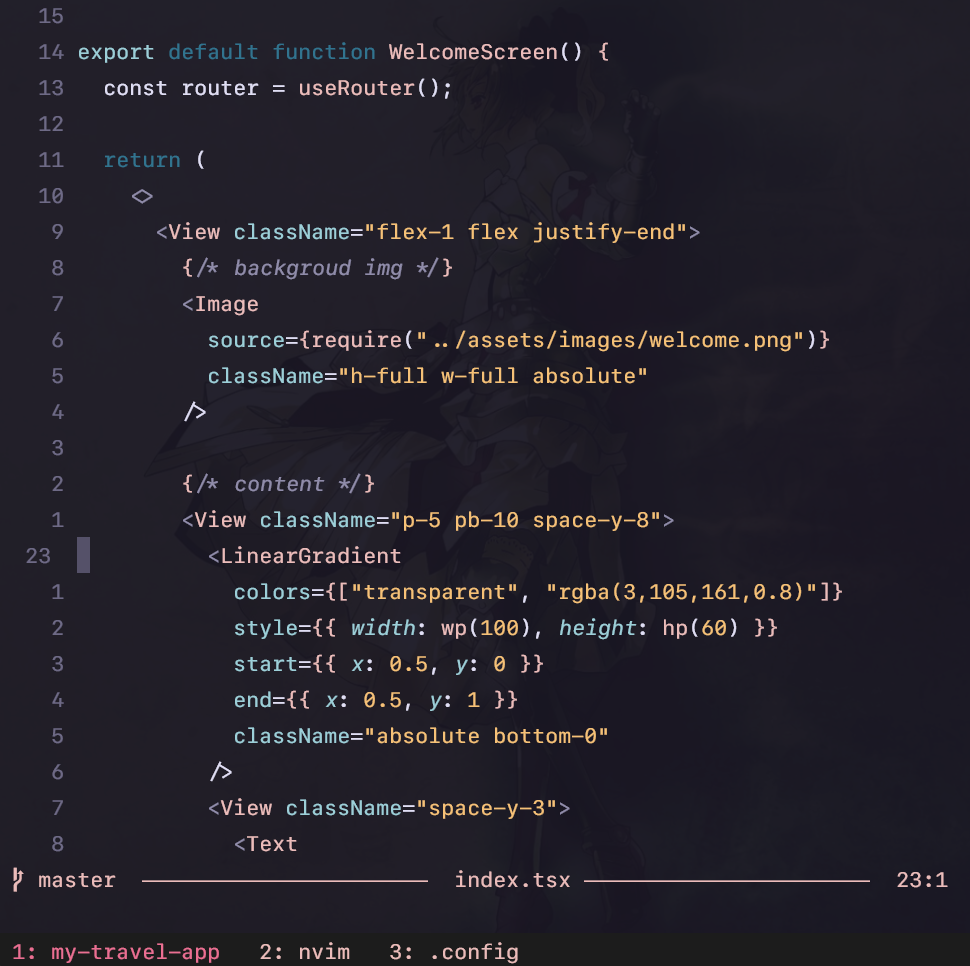

# Mateus Queirós’s dotfiles



This is my configuration for a Neovim setup, mainly focused on React and Web development.

## Overview

- [Neovim](https://neovim.io/) config using [Lazy.nvim](https://github.com/folke/lazy.nvim)
- tmux
- zsh (Oh My Zsh + powerlevel10k)
- Windows Terrminal
- AutoHotkey bindings

### Requirements

- Neovim ≥ **0.9.0**
- Git
- LazyVim
- a Nerd Font (I use Liga SF Nerd Font)
- For Telescope:
    - ripgrep
    - fd
- Windows Terminal (or other terminal emulator)

## Installation

A Bash Script is available to automatize the steps below for you!

```bash
sudo apt update && sudo apt install -y tar curl && mkdir ~/install-config && cd ~/install-config && curl https://codeload.github.com/mateuscqueiros/dotfiles/tar.gz/master | tar -xz --strip=2 dotfiles-master/install && chmod -R u+x ~/install-config && echo "0" | ./install.sh && rm -rf ./install-config
```

Break down:
```bash
# Make sure you are on root before all of this
sudo apt update && sudo apt install tar curl

# Create a installation directory
mkdir ~/install-config && cd ~/install-config

# Download and extract the installation folder
curl https://codeload.github.com/mateuscqueiros/dotfiles/tar.gz/master | \tar -xz --strip=2 dotfiles-master/install

# Give exec permission to folder and run the script
chmod -R u+x ~/install-config && echo "0" | ./install.sh
```

After that, restart your machine. Open Neovim and let Lazy install the plugins. Once possible, open a file and let Mason install the LSPs (just leave it alone for about a minute). Set a colorscheme through `:colorscheme rose-pine`. After all downloads finish, quit Neovim and reopen it. You are done!

## SSH

Generate a new SSH key and add it to [your Github account](https://github.com/settings/keys). Test the connection.
```bash
ssh-keygen -t ed25519 -C "mateuscqueiros@gmail.com"
xclip -sel clip < ~/.ssh/id_ed25519.pub
ssh -T git@github.com
ssh-add ~/.ssh/id_ed25519
```

## Step by step

This config is optimal for Debian or Ubuntu. My main workspace is Ubuntu WSL. Make sure to not just blindly run the commands. Read the comments, as they add some important instructions and references.

### Pre-requisites

Install git, install FUSE and clone this repo at your root.

```bash
sudo apt install git
sudo add-apt-repository universe
sudo apt install libfuse2

git clone https://github.com/mateuscqueiros/dotfiles ~/.config
```

### Zsh

Install Zsh

```bash
sudo apt update
sudo apt install zsh -y
zsh --version

# Initialize ZSH
# When prompted press '0'
zsh
```

Install [Oh My Zsh](https://ohmyz.sh/#install):

```bash
sh -c "$(wget https://raw.githubusercontent.com/ohmyzsh/ohmyzsh/master/tools/install.sh -O -)"

# When asked if you want to make ZSH your default sheel press 'Y'
```

Symlink `~/.config/zsh/.zshrc`:

```bash
rm -rf ~/.zshrc

ln -s ~/.config/zsh/.zshrc ~/.zshrc
```

Download Oh My Zsh plugins:

```bash
# powerlevel10k
# https://github.com/romkatv/powerlevel10k?tab=readme-ov-file#oh-my-zsh
git clone --depth=1 https://gitee.com/romkatv/powerlevel10k.git ${ZSH_CUSTOM:-$HOME/.oh-my-zsh/custom}/themes/powerlevel10k

# zsh-autosuggestions
# https://github.com/zsh-users/zsh-autosuggestions/blob/master/INSTALL.md#oh-my-zsh
git clone https://github.com/zsh-users/zsh-autosuggestions ${ZSH_CUSTOM:-~/.oh-my-zsh/custom}/plugins/zsh-autosuggestions

# zsh-syntax-highlighting
# https://github.com/zsh-users/zsh-syntax-highlighting/blob/master/INSTALL.md#oh-my-zsh
git clone https://github.com/zsh-users/zsh-syntax-highlighting.git ${ZSH_CUSTOM:-~/.oh-my-zsh/custom}/plugins/zsh-syntax-highlighting

```

Source `~/.zshrc`:

```bash
source ~/.zshrc
```

If you have not done it yet, set up SSH keys so Zsh can start the ssh-agent when you logiN.

If the content of `~/.config/zsh/.zshrc` was overwritten by Oh My Zsh at some point then copy and paste it from this repository.

### Tmux

```bash
sudo apt install tmux

git clone https://github.com/tmux-plugins/tpm ~/.tmux/plugins/tpm;

ln -s ~/.config/tmux/.tmux.conf ~/.tmux.conf
```

### Neovim

Install the following dependencies:

```bash
sudo apt install ripgrep
sudo apt install fd-find
```

Install Neovim from AppImage

```bash
# Make sure you are on root before all of this

curl -LO https://github.com/neovim/neovim/releases/latest/download/nvim.appimage
chmod u+x nvim.appimage
sudo mv nvim.appimage /usr/local/bin/nvim

# Clone the actual Neovim config to ~/.config/nvim
git clone https://github.com/mateuscqueiros/nvim.config ~/.config/nvim

# Start plugin installation by Lazy
nvim ~/.config/nvim
```

Once the installation process from Lazy is finished quit Neovim and run it again. That’s it!

Note: some errors related to coloschemes may appear. To fix that, just select a colorscheme and restart Neovim.
